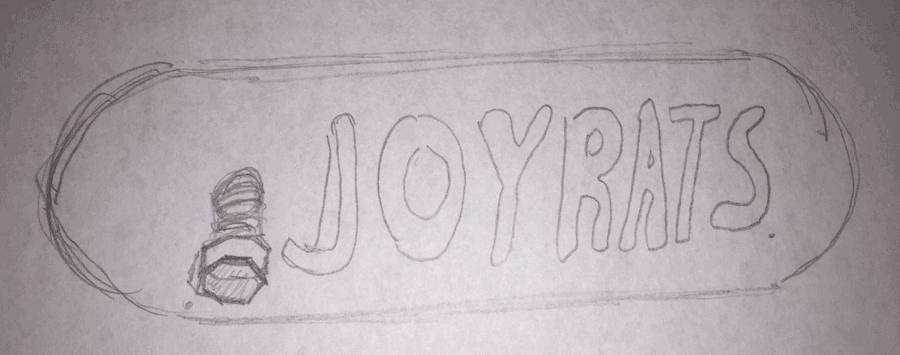
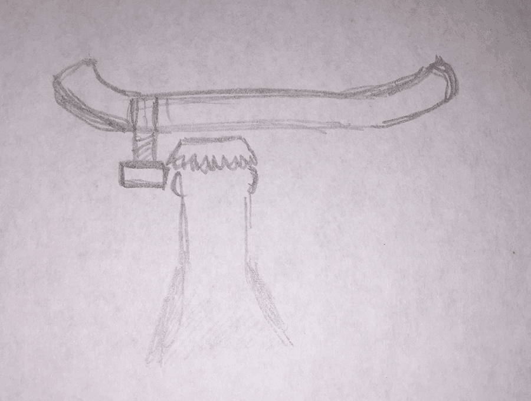

Bottle openers are weird... on the one hand they symbolize a good time, a precursor to some sweet sweet alcohol.

On the other hand, my relationship with alcohol is complex. We drink too much and I almost see it as a social tick. In some ways, I think alcohol (and bars) are how we monetize the need for play in adulthood.

Sometimes we drink too much. Truth be told, we think that's healthy because it helps release something in us, something pent up. I've a theory that what is released is the tension we build up by not playing.

Alcohol can also dull our creativity. I think we reach for it too quickly in an attempt to make a boring moment more interesting. BUT I think there's power in staying in that boring moment.

It's a sedative, obviously, and we use it to dull our feelings, or sometimes as an aid to express our feelings.

Bottle openers are the adult invite to playing. Although I feel weird about the type of play that pops up around alcohol... which tends to be a very sedentary and verbal play.

It greases our social lives, because we are all too awkward to initiate play. Is it filling in for play? Or is it enhancing play? As an enhancement for whatever we plan to do anyway... Or is it greasing play? It helps us become more open... we allow ourselves to cast off a bit of adulthood so that we might do stupid, juvenile things again.

At the same time, there's a lot of snobbery in it. Is that just some adults wanting to feel like they are more adult than others? Is that bad? How do I feel about this...

